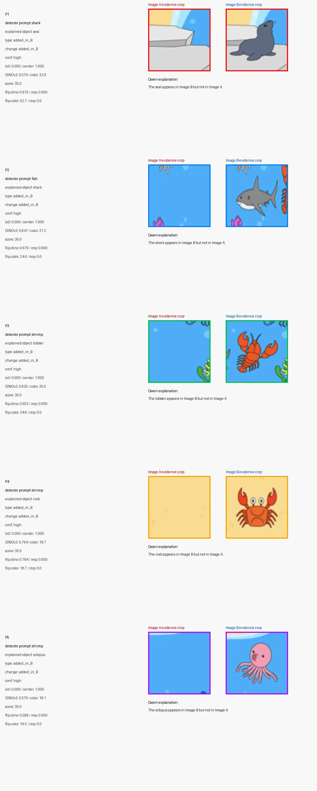

# Evidence-Grounded Visual Difference Explainer

This project implements an evidence-grounded visual difference explanation system using three foundation models.

The goal is not only to say that two images are different, but also to show **where** the differences are located using bounding boxes and crop evidence, and then explain the visual difference in natural language.

## 1. Overview

Given two input images, Image A and Image B, the system detects object-level visual differences such as:

* color changes
* appearance changes
* added objects
* missing objects
* object-like region changes

The system uses three foundation models:

1. **Qwen2-VL**
   Proposes object tag candidates from the two images and later generates a natural language explanation from selected crop evidence.

2. **Grounding DINO**
   Grounds the object tags into bounding boxes in each image.

3. **DINOv2**
   Compares matched crop pairs using visual feature distance to score how visually different the two regions are.

The final output includes:

* all detected Grounding DINO boxes
* final difference boxes on both images
* evidence crop pairs
* DINOv2 / color difference scores
* natural language explanations

## 2. Installation Guide

### 2.1. Create a Python environment

```bash
conda create -n visual_diff python=3.10 -y
conda activate visual_diff
```

### 2.2. Install PyTorch

Install PyTorch according to your CUDA version. For example, with CUDA 12.1:

```bash
pip install torch torchvision torchaudio --index-url https://download.pytorch.org/whl/cu121
```

### 2.3. Install required packages

```bash
pip install transformers accelerate gradio pillow opencv-python scipy qwen-vl-utils
```

If needed, install additional Hugging Face dependencies:

```bash
pip install sentencepiece einops timm
```

## 3. How to Run

Run the main demo file:

```bash
python demo.py
```

If you want to specify a GPU:

```bash
CUDA_VISIBLE_DEVICES=0 python demo.py
```

After running the script, a Gradio interface will open. Upload Image A and Image B, then click:

```text
Run Position-Based Box Matching Pipeline
```

## 4. Code Explanation

The main code is implemented in `demo.py`.

### 4.1. Model Loading

The code loads the following models:

```python
QWEN_MODEL_ID = "Qwen/Qwen2-VL-7B-Instruct"
DINO_MODEL_ID = "IDEA-Research/grounding-dino-tiny"
DINOV2_MODEL_ID = "facebook/dinov2-base"
```

* Qwen2-VL is used for object tag proposal and evidence explanation.
* Grounding DINO is used for open-vocabulary object detection.
* DINOv2 is used for crop-level visual feature comparison.

### 4.2. Object Tag Proposal

The function `qwen_extract_object_tags()` asks Qwen2-VL to list visible object categories from the two input images.

This step produces detector-friendly object tags such as:

```text
fish, turtle, coral, shell, shrimp
```

These tags are not treated as final answers. They are used as open-vocabulary prompts for Grounding DINO.

### 4.3. Object Detection with Grounding DINO

The function `detect_all_tags()` runs Grounding DINO for each object tag.

For each image, the system obtains:

* object tag
* bounding box
* detection score

The detected boxes are visualized in the UI.

### 4.4. Position-Based Box Matching

The function `match_boxes_and_score()` matches boxes between Image A and Image B.

The matching uses:

* IoU
* expanded IoU
* center distance
* box size similarity
* object tag similarity

This creates crop pairs that represent corresponding visual regions between the two images.

### 4.5. DINOv2 Visual Difference Scoring

For each matched crop pair, DINOv2 computes a visual feature distance.

The system also computes a color difference score. These scores are used to estimate whether the crop pair contains a meaningful visual difference.

Examples:

```text
High DINOv2 distance + high color score → appearance or object-like region change
Low DINOv2 distance + high color score → color change
Unmatched object box → added or missing object
```

### 4.6. Qwen2-VL Explanation

After the system selects important evidence crop pairs, Qwen2-VL generates a natural language explanation.

The system first builds visual evidence using Grounding DINO boxes, position-based matching, and DINOv2 crop comparison. Qwen2-VL then verbalizes the selected crop evidence into a readable explanation.

## 5. Example Output

The demo displays:

1. Qwen2-VL object tags
2. Grounding DINO detection boxes
3. Final difference boxes on Image A and Image B
4. Evidence crop montage
5. Natural language explanation

Example explanation:

```text
The coral in Image A is orange, while in Image B it is blue.
```

Another example:

```text
The seal appears in Image B but not in Image A.
```

## 6. Summary

This project combines Qwen2-VL, Grounding DINO, and DINOv2 into one visual difference explanation pipeline.

The main contribution is an evidence-grounded workflow:

```text
Qwen2-VL object tags
→ Grounding DINO bounding boxes
→ position-based crop matching
→ DINOv2 visual difference scoring
→ Qwen2-VL natural language explanation
```

This allows the system to show both the visual evidence and the explanation for the detected differences.

## Demo Example

The figure below shows an example output of the system, including final difference boxes and evidence crop explanations.


